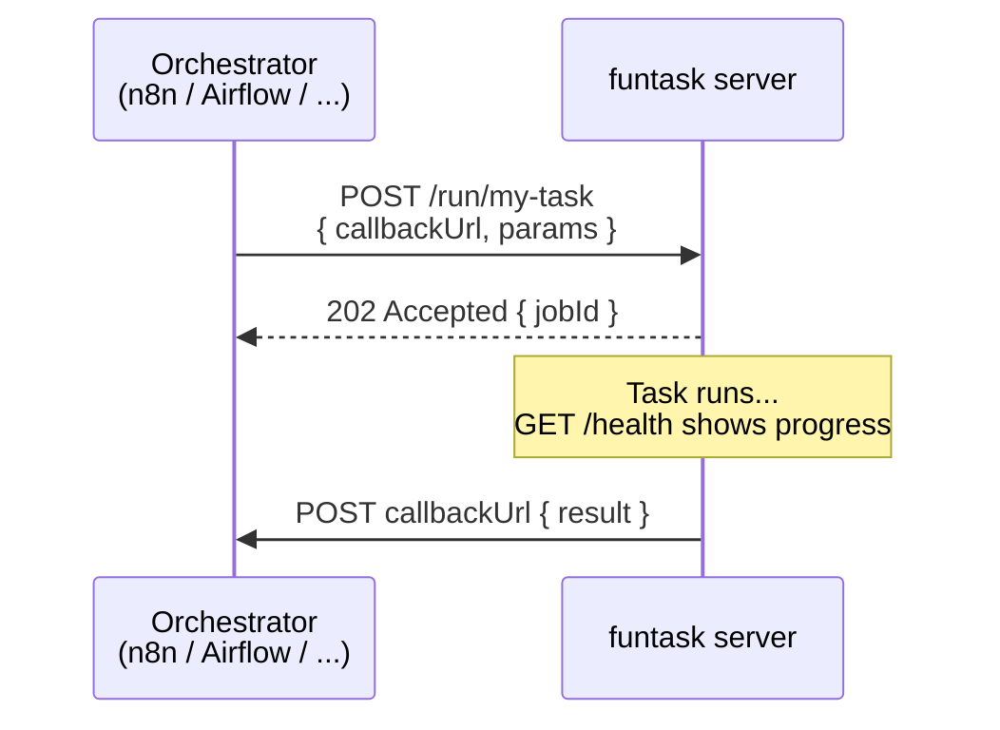
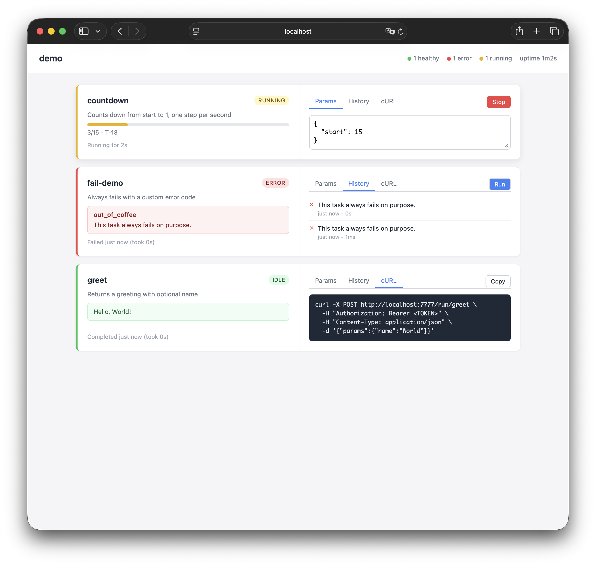

# funtask

Turn any Go function into an HTTP-callable task - with progress, callbacks, and a built-in dashboard.

[](https://github.com/funktionslust/funtask/actions)
[](https://goreportcard.com/report/github.com/funktionslust/funtask)
[](https://pkg.go.dev/github.com/funktionslust/funtask)
[](https://codecov.io/gh/funktionslust/funtask)
[](https://github.com/funktionslust/funtask)

Works with n8n, Airflow, Temporal, Prefect, or any system that can POST JSON and receive callbacks. Zero dependencies - stdlib only.

## How it works



## Install

```sh
go get github.com/funktionslust/funtask@latest
```

## Quick start

```go
package main

import (
    "log"
    "os"
    "time"

    "github.com/funktionslust/funtask"
)

func main() {
    s := funtask.New("my-server",
        funtask.Task("greet", greet).
            Description("Returns a greeting").
            Example(map[string]any{"name": "World"}),
        funtask.Task("countdown", countdown).
            Description("Counts down from start to 1").
            Example(map[string]any{"start": 5}),
        funtask.WithAuthToken(os.Getenv("FUNTASK_AUTH_TOKEN")),
        funtask.WithDeadLetterDir(os.Getenv("FUNTASK_DEAD_LETTER_DIR")),
        funtask.WithDashboard(),
    )
    log.Fatal(s.ListenAndServe(":8080"))
}

func greet(_ *funtask.Run, params funtask.Params) funtask.Result {
    name, _ := params.String("name")
    if name == "" {
        name = "World"
    }
    return funtask.OK("Hello, %s!", name).WithData("name", name)
}

func countdown(ctx *funtask.Run, params funtask.Params) funtask.Result {
    start, err := params.Int("start")
    if err != nil {
        return funtask.Fail("invalid_params", "%v", err)
    }
    for i := range start {
        ctx.Progress(i+1, start, "T-%d", start-i)
        select {
        case <-ctx.Done():
            return funtask.Fail("cancelled", "stopped at T-%d", start-i)
        case <-time.After(1 * time.Second):
        }
    }
    return funtask.OK("Countdown complete.").WithData("start", start)
}
```

```sh
export FUNTASK_AUTH_TOKEN=secret
export FUNTASK_DEAD_LETTER_DIR=/tmp/dead-letters
mkdir -p $FUNTASK_DEAD_LETTER_DIR
go run .

# Open the dashboard:
open http://localhost:8080/dashboard

# Sync call (blocks until done):
curl -H "Authorization: Bearer secret" \
  -d '{"params":{"name":"World"}}' localhost:8080/run/greet

# Async call (returns immediately, posts result to callback):
curl -H "Authorization: Bearer secret" \
  -d '{"callbackUrl":"https://example.com/webhook","params":{"start":5}}' \
  localhost:8080/run/countdown
```

## Task definition

Register tasks with `Task()`. Chain `Description()` and `Example()` to add
metadata visible in `/health` and the dashboard:

```go
funtask.Task("sync-orders", syncOrders).
    Description("Syncs open orders from Shopify to SAP").
    Example(map[string]any{"since": "2025-01-01", "limit": 100})
```

`Description()` shows as a subtitle on the dashboard card. `Example()` pre-fills
the params editor and appears in the `/health` JSON.

## Dashboard

Enable the built-in developer dashboard with `WithDashboard()`:

```go
funtask.WithDashboard()
```

Open `/dashboard` in a browser. It provides:

- Live task status via SSE (no polling)
- Progress bars and step descriptions
- Error details for failed tasks
- Params editor with pre-filled examples
- Run / Stop buttons per task
- cURL snippet generator



The dashboard page is served without bearer-token auth. Authentication is handled
client-side - the browser prompts for the token and calls `/health` before
showing any data.

## API

| Endpoint | Method | Auth | Description |
|---|---|---|---|
| `/run/{task}` | POST | Bearer | Run a task (sync or async with `callbackUrl`) |
| `/stop/{task}` | POST | Bearer | Cancel a running task |
| `/result/{jobId}` | GET | Bearer | Fetch a stored result |
| `/health` | GET | Bearer | Server status and per-task progress |
| `/events` | GET | Bearer / `?token=` | SSE stream of health snapshots (query param because EventSource cannot send headers) |
| `/dashboard` | GET | None (client-side) | Developer dashboard UI |
| `/livez` | GET | None | Liveness probe |
| `/readyz` | GET | None | Readiness probe |

## Configuration

```go
funtask.New("my-server",
    // Tasks (at least one required)
    funtask.Task("name", fn).
        Description("human-readable description").
        Example(map[string]any{"key": "value"}).
        KeepResults(20),  // per-task result history override

    // Security (required)
    funtask.WithAuthToken("token"),
    funtask.WithDeadLetterDir("/path/to/dead-letters"),

    // Dashboard
    funtask.WithDashboard(),

    // Timeouts
    funtask.WithMaxDuration(10 * time.Minute),
    funtask.WithSyncTimeout(2 * time.Minute),
    funtask.WithShutdownTimeout(30 * time.Second),

    // Callbacks
    funtask.WithCallbackAllowlist("https://hooks.example.com"),
    funtask.WithCallbackRetries(5),
    funtask.WithCallbackTimeout(30 * time.Second),

    // Result history
    funtask.WithResultHistory(10),   // server-wide default per task

    // Extensibility
    funtask.WithReadiness(func() error { return nil }),
    funtask.WithHandler("GET /custom", myHandler),
)
```

## Result patterns

```go
// Success
return funtask.OK("processed %d records", count).
    WithData("count", count)

// Failure with error code
return funtask.Fail("db_error", "connection refused to %s", host)

// Wrap a Go error
return funtask.FailFromError(err)
```

## Progress reporting

```go
ctx.Step("connecting to database")
ctx.Progress(i, total, "processing record %d", i)
```

Progress is visible in `/health`, the SSE event stream, and the dashboard.

## License

[MIT](LICENSE)

---

**Built by Wolfgang Stark, [Funktionslust GmbH](https://funktionslust.digital)**<br>
*Enterprise software development and consulting.*
