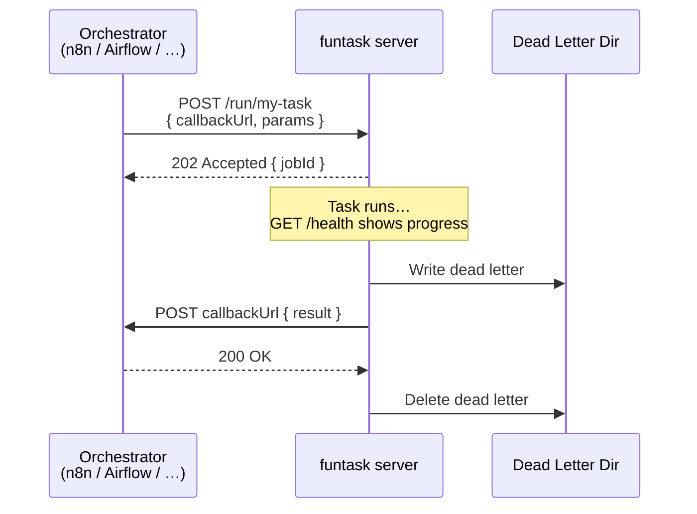

# funtask

[](https://github.com/funktionslust/funtask/actions)
[](https://goreportcard.com/report/github.com/funktionslust/funtask)
[](https://pkg.go.dev/github.com/funktionslust/funtask)
[](https://codecov.io/gh/funktionslust/funtask)
[](https://github.com/funktionslust/funtask)

Go library that turns functions into webhook-callable HTTP task servers.

Works with n8n, Airflow, Temporal, Prefect, or any system that can POST JSON and receive callbacks.

## How it works



## Install

```sh
go get github.com/funktionslust/funtask@latest
```

## Quick start

```go
package main

import (
    "log"
    "os"
    "time"

    "github.com/funktionslust/funtask"
)

func main() {
    s := funtask.New("counter",
        funtask.WithTask("count-up", countUp),
        funtask.WithAuthToken(os.Getenv("FUNTASK_AUTH_TOKEN")),
        funtask.WithDeadLetterDir(os.Getenv("FUNTASK_DEAD_LETTER_DIR")),
        funtask.WithCallbackAllowlist("https://example.com"),
    )
    log.Fatal(s.ListenAndServe(":8080"))
}

func countUp(ctx *funtask.Run, params funtask.Params) funtask.Result {
    limit, err := params.Int("limit")
    if err != nil {
        return funtask.Fail("invalid_params", "%v", err)
    }
    for i := 1; i <= limit; i++ {
        ctx.Progress(i, limit, "Count: %d", i)
        select {
        case <-ctx.Done():
            return funtask.Fail("cancelled", "stopped at %d", i)
        case <-time.After(1 * time.Second):
        }
    }
    return funtask.OK("Counted to %d", limit)
}
```

```sh
export FUNTASK_AUTH_TOKEN=secret
export FUNTASK_DEAD_LETTER_DIR=/tmp/dead-letters
mkdir -p $FUNTASK_DEAD_LETTER_DIR
go run main.go

# Sync call (blocks until done):
curl -H "Authorization: Bearer secret" \
  -d '{"params":{"limit":5}}' localhost:8080/run/count-up

# Async call (returns immediately, posts result to callback):
curl -H "Authorization: Bearer secret" \
  -d '{"callbackUrl":"https://example.com/webhook","params":{"limit":5}}' \
  localhost:8080/run/count-up
```

## API

| Endpoint | Method | Auth | Description |
|---|---|---|---|
| `/run/{task}` | POST | Bearer | Run a task (sync or async with `callbackUrl`) |
| `/stop/{task}` | POST | Bearer | Cancel a running task |
| `/result/{jobId}` | GET | Bearer | Fetch cached result (5 min TTL) |
| `/health` | GET | Bearer | Server status and per-task progress |
| `/livez` | GET | No | Liveness probe |
| `/readyz` | GET | No | Readiness probe |

## License

[MIT](LICENSE)

---

**Built by Wolfgang Stark, [Funktionslust GmbH](https://funktionslust.digital)**<br>
*Enterprise software development and consulting.*
